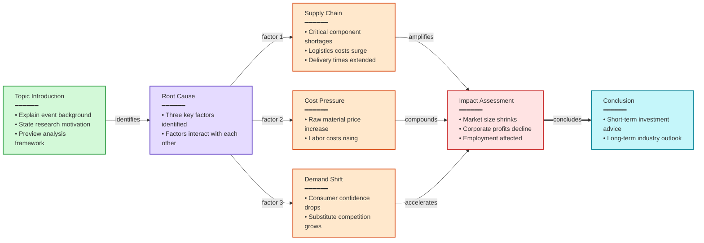
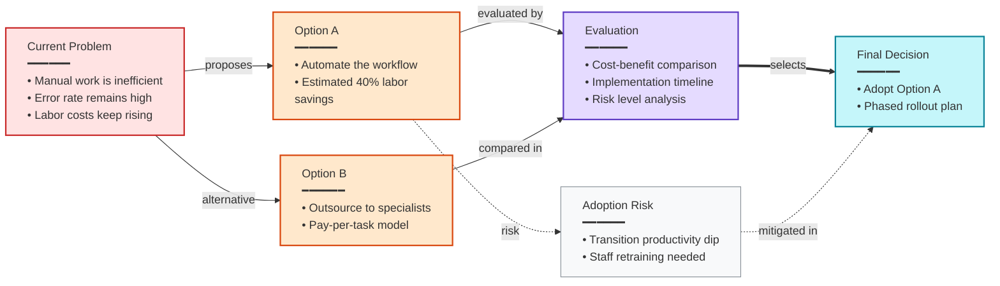

Based on the video summary below, create Mermaid flowcharts showing the narrative logic and key relationships.
Produce one diagram for each chapter section in the summary that is suitable for visualization.

Output format:
Each diagram corresponds to a chapter section in the summary. The diagram heading must use the #### prefix followed by the exact chapter title text from the summary.
If a section is not suitable for a flowchart, you may skip it.
No blank line between the heading and ```mermaid.

Strict rules:
- First line must be graph with direction: default to graph LR (left-to-right). Only use graph TB (top-to-bottom) when content has clear hierarchical or tree-like branching, and TB diagrams must not exceed 4 nodes
- Node text format: Title<br/>━━━━━━<br/>• Point one<br/>• Point two<br/>• Point three, use bullet list for details, at least 2-3 points per node
- Node format: UPPERCASE["<div style='text-align:left'>Title<br/>━━━━━━<br/>• Point one<br/>• Point two</div>"], wrap in div for left-align, e.g. A["<div style='text-align:left'>Introduction<br/>━━━━━━<br/>• Explain the background<br/>• State the core question</div>"]
- Connection types: A --> B (main flow), A -.-> B (supplementary/optional), A ==> B (emphasis)
- EVERY arrow MUST have a label explaining "why" or "how" nodes connect: A -->|causes| B. No bare arrows without labels. Examples: causation (leads to, causes), conditions (if success, if failure), method (via API), feedback (corrects). Keep labels to 2-6 words
- 5-12 nodes per diagram
- Choose topology based on content logic (branching, convergence, parallel paths, loops, etc.) — avoid making every diagram a simple linear chain
- Avoid vertical straight chains of more than 3 nodes; if a TB diagram becomes a long chain, switch to LR or add branching
- If the content is a linear narrative with no natural branching, merge related steps into a single node (use bullet points), increase per-node information density, and keep nodes to 3-6 to avoid long straight lines
- Wrap in ```mermaid and ```
- Output only diagram headings and Mermaid code blocks, no other explanation text
- Every node MUST have a corresponding style declaration, choosing colors from the color guide based on semantic role — do not omit any

Syntax safety rules:
- Node text must be wrapped in double quotes: ["text"]
- Never use "number. space" pattern in node text (e.g. 1. Step), use "1.Step" or "Step 1:" instead
- No emoji in node text
- Avoid half-width quotes or parentheses in node text
- Keep title under 40 characters, each bullet point under 50 characters, 2-4 points per node

Color guide (choose by semantic role):
- Green fill:#d3f9d8,stroke:#2f9e44 — opening, input, start
- Red fill:#ffe3e3,stroke:#c92a2a — problem, decision, conflict
- Purple fill:#e5dbff,stroke:#5f3dc4 — analysis, reasoning, core argument
- Orange fill:#ffe8cc,stroke:#d9480f — action, method, tool
- Cyan fill:#c5f6fa,stroke:#0c8599 — result, conclusion, output
- Yellow fill:#fff4e6,stroke:#e67700 — data, memory, reference
- Gray fill:#f8f9fa,stroke:#868e96 — background, context, supplement

Example output:
#### Overall Narrative Flow


#### Solution Comparison and Decision


Summary:
{{summary}}