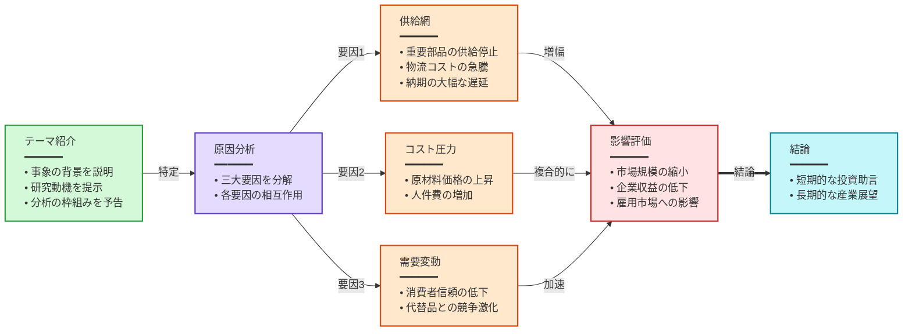
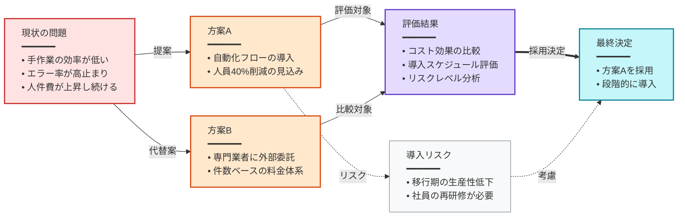

以下の動画要約に基づき、Mermaid フローチャートで動画の論理構成や主要な関係性を表現してください。
要約の各セクションのうち、視覚化に適したものごとに1つの図表を生成すること。

出力形式：
各図表は要約のセクションに対応する。図表の見出しは #### プレフィックスの後に要約のセクションタイトルのテキストを正確に記述すること。
フローチャートに適さないセクションはスキップ可能。
見出しと ```mermaid の間に空行を入れないこと。

厳格ルール：
- 最初の行は graph と方向：デフォルトは graph LR（左から右）。明確な階層構造やツリー型の分岐がある場合のみ graph TB（上から下）を使用し、TB の場合はノード数を 4 個以内に制限
- ノードテキスト形式：タイトル<br/>━━━━━━<br/>• 要点一<br/>• 要点二<br/>• 要点三、詳細は箇条書きで記述し、各ノード最低 2-3 個の要点を含める
- ノード形式：大文字["<div style='text-align:left'>タイトル<br/>━━━━━━<br/>• 要点一<br/>• 要点二</div>"]、div で左揃えに包む、例：A["<div style='text-align:left'>導入<br/>━━━━━━<br/>• 背景の説明<br/>• 核心的な問題の提示</div>"]
- 接続形式：A --> B（メインフロー）、A -.-> B（補足/任意）、A ==> B（強調）
- すべての矢印に必ずラベルを付けて、ノード間の「なぜ」「どのように」を説明する：A -->|原因| B。ラベルなしの矢印は禁止。例：因果（導く、引き起こす）、条件（成功時、失敗時）、手段（API経由）、フィードバック（修正）。ラベルは2-6文字に収める
- 各図表 5-12 個のノード
- 内容の論理関係に応じて適切なトポロジを選択（分岐、合流、並列、ループなど）し、すべての図表が単純な直線チェーンにならないようにする
- 3 個以上のノードの垂直直線チェーンを避ける。TB 図表が長い直線になる場合は LR に切り替えるか分岐を追加する
- 内容が分岐のない線形的な流れの場合、関連するステップを1つのノードに統合し（箇条書きで列挙）、ノードあたりの情報密度を高め、ノード数を3-6個に抑えて長い直線を避ける
- ```mermaid と ``` で囲む
- 図表の見出しと Mermaid コードブロックのみ出力し、その他の説明文は不要
- すべてのノードに対応する style 宣言が「必須」。色彩ガイドからノードの意味的役割に応じて選色し、省略不可

構文安全ルール：
- ノードテキストは必ずダブルクォートで囲む：["テキスト"]
- ノードテキストに「数字. スペース」パターンを使用しない（例：1. ステップ）、代わりに「1.ステップ」や「① ステップ」を使用
- ノードテキストに絵文字を使用しない
- ノードテキストに半角引用符や括弧を避け、『』や「」を使用
- 各ノードのタイトルは25文字以内、各要点は30文字以内、各ノード 2-4 個の要点

色彩ガイド（意味に応じて選択）：
- 緑 fill:#d3f9d8,stroke:#2f9e44 — 導入、入力、開始
- 赤 fill:#ffe3e3,stroke:#c92a2a — 問題、決定、対立
- 紫 fill:#e5dbff,stroke:#5f3dc4 — 分析、推論、核心的主張
- 橙 fill:#ffe8cc,stroke:#d9480f — 行動、方法、ツール
- 青緑 fill:#c5f6fa,stroke:#0c8599 — 結果、結論、出力
- 黄 fill:#fff4e6,stroke:#e67700 — データ、記憶、参照
- 灰 fill:#f8f9fa,stroke:#868e96 — 背景、文脈、補足

出力例：
#### 動画全体の論理構成


#### 解決策の比較と選択


要約：
{{summary}}