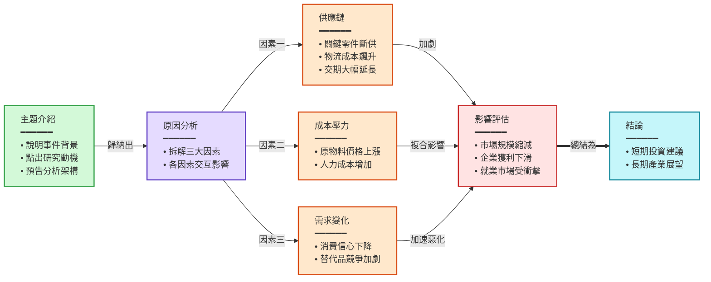
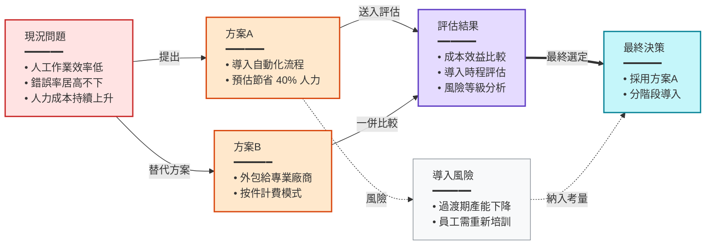

請根據以下影片摘要，用 Mermaid 流程圖呈現影片的敘事邏輯或核心概念的關係。
為摘要中適合視覺化的各章節各產生一個圖表。

輸出格式：
每個圖表對應摘要中的一個章節。圖表標題使用 #### 前綴，後接摘要中的章節標題文字（必須完全一致）。
如果某個章節不適合用流程圖表達，可以跳過該章節。
標題與 ```mermaid 之間不要有空行。

嚴格規則：
- 第一行必須是 graph 加方向：預設使用 graph LR（左到右）。僅在內容具有明確的階層或樹狀分支結構時才使用 graph TB（上到下），且 TB 方向的節點數不得超過 4 個
- 節點文字格式：標題<br/>━━━━━━<br/>• 要點一<br/>• 要點二<br/>• 要點三，細節用條列式呈現，每個節點至少 2-3 個要點
- 節點格式：大寫字母["<div style='text-align:left'>標題<br/>━━━━━━<br/>• 要點一<br/>• 要點二</div>"]，用 div 左齊包裹，例如 A["<div style='text-align:left'>開場<br/>━━━━━━<br/>• 說明影片背景<br/>• 點出核心問題</div>"]
- 連接格式：A --> B（主線）、A -.-> B（補充/可選）、A ==> B（強調）
- 每條箭頭都「必須」加上標籤，說明節點之間「為什麼」或「如何」連接：A -->|導致| B。不可有沒標籤的裸箭頭。例如：因果（導致、造成）、條件（若成功、若失敗）、方式（透過 API）、反饋（修正）。標籤控制在 2-6 字
- 每個圖表 5-12 個節點
- 根據內容的邏輯關係選擇合適的拓撲結構（分支、匯聚、並行、迴圈等），避免所有圖表都是單純的直線鏈
- 避免超過 3 個節點的垂直直線鏈；若 TB 圖表出現長直線，應改用 LR 或增加分支
- 若內容為線性敘事且無法產生分支結構，應合併相關步驟到同一節點（用條列要點列舉），提高單節點資訊密度，將節點數控制在 3-6 個，避免長直線
- 用 ```mermaid 和 ``` 包裹
- 除了圖表標題外，不要輸出任何其他說明文字
- 每個節點都「必須」有對應的 style 宣告，根據節點的語意角色從色彩指引中選色，不可省略

語法安全規則：
- 節點文字必須用雙引號包裹：["文字"]
- 節點文字中不可出現「數字. 空格」的格式（如 1. 步驟），改用「1.步驟」或「① 步驟」
- 節點文字中不可使用 emoji
- 節點文字中避免使用半形引號或括號，改用『』和「」
- 每個節點的標題控制在 20 字以內，每個要點控制在 25 字以內，每節點 2-4 個要點

色彩指引（依語意選用）：
- 綠色 fill:#d3f9d8,stroke:#2f9e44 — 開場、輸入、起始
- 紅色 fill:#ffe3e3,stroke:#c92a2a — 問題、決策、衝突
- 紫色 fill:#e5dbff,stroke:#5f3dc4 — 分析、推理、核心論述
- 橘色 fill:#ffe8cc,stroke:#d9480f — 行動、方法、工具
- 青色 fill:#c5f6fa,stroke:#0c8599 — 結果、結論、產出
- 黃色 fill:#fff4e6,stroke:#e67700 — 數據、記憶、資料
- 灰色 fill:#f8f9fa,stroke:#868e96 — 背景、脈絡、補充

範例輸出：
#### 影片整體敘事流程


#### 解決方案的比較與選擇


摘要：
{{summary}}