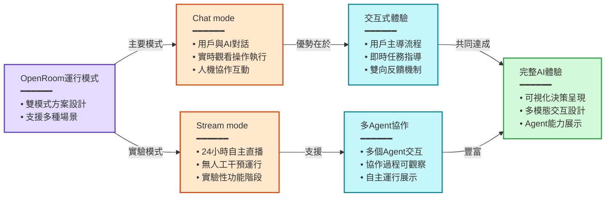
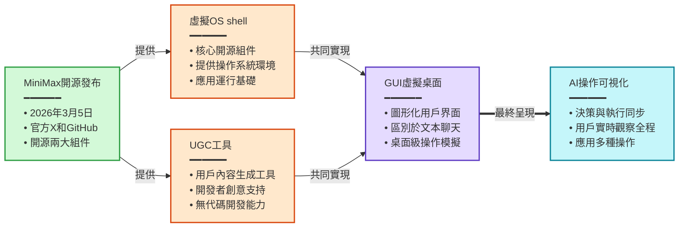
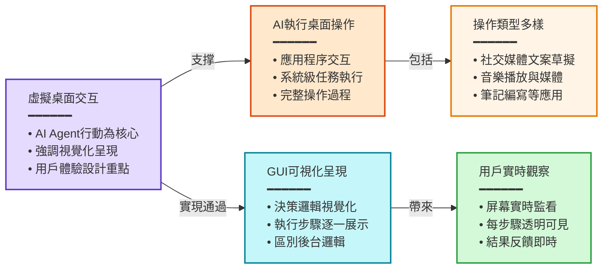
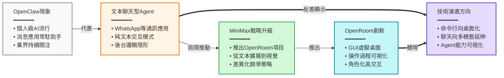
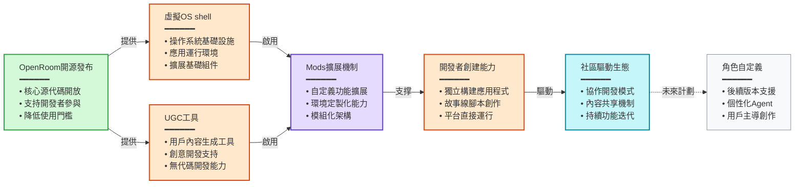

> [!info] 來源資訊
> - **原始網址**：[ledge.ai](https://ledge.ai/articles/minimax_openroom_gui_agent_open_source_virtual_desktop)
> - **加入日期**：2026-03-27
> - **來源**：Safari Reading List
> - **摘要工具**：claude-code (haiku)
> - **處理日期**：2026-03-29

---

### 概述

中国AI企业MiniMax（上海）于2026年3月5日开源发布了OpenRoom项目，这是一个让AI角色在虚拟桌面环境中执行操作的GUI平台。OpenRoom突破了传统聊天界面的限制，将AI Agent的行动可视化为虚拟操作系统上的实际操作过程，用户可在屏幕上看到AI执行应用程序操作、文本生成、音乐播放、笔记编写等任务。该项目提供Chat mode（实时交互）和Stream mode（24小时自主运行）两种操作模式，并支持开发者通过UGC工具和"mods"扩展功能，推动AI Agent体验从文本驱动向多模态交互的演进。

### 章節摘要

#### MiniMax OpenRoom的开源发布与核心概念

- MiniMax于2026年3月5日通过官方X账号和GitHub正式公开OpenRoom项目
- 项目包括虚拟操作系统（OS）shell和用户生成内容（UGC）工具两个核心开源组件
- OpenRoom采用GUI（图形用户界面）设计，而非传统的纯文本聊天界面
- AI角色能够执行包括应用操作、文本生成等各种桌面级操作，并将整个过程可视化

#### 虚拟桌面环境的特征与交互方式

- AI角色在虚拟桌面环境中的操作包括：起草社交媒体帖文、播放音乐、编写笔记等真实OS操作
- 设计将AI Agent的动作作为用户体验的核心，而非单纯的后台逻辑
- 区别于传统聊天UI，OpenRoom通过GUI可视化呈现AI Agent的决策与执行过程
- 用户可通过屏幕实时观察AI的每一个操作步骤与结果

#### 双模式运行机制：交互模式与自主运行模式

- **Chat mode**：用户与AI角色进行对话，同时实时观看AI执行操作，形成交互式体验
- **Stream mode（实验性功能）**：AI在无人工干预的情况下持续自主操作虚拟环境
  - 采用24小时直播（livestream）形式运营
  - 支持多个Agent之间相互交互，用户可观察多Agent协作的过程
  - 目前处于试验阶段

#### OpenClaw热潮背景下的AI Agent发展脉络

- MiniMax将OpenRoom的推出置于更广泛的AI Agent产业发展背景中
- **OpenClaw的影响**：作为个人级AI Agent基础，通过WhatsApp、Telegram、Slack等消息应用提供常驻型AI助手，引发业界关注
- OpenRoom与OpenClaw的核心差异：OpenClaw以文本聊天为中心，而OpenRoom强调虚拟桌面GUI环境中的可视化行动
- MiniMax的战略意图：将基于文本的Agent体验扩展至具备角色性、高度交互性的虚拟桌面环境

#### 开发者生态与用户扩展能力

- 开源发布包含虚拟OS shell和UGC工具，允许开发者创建自定义功能
- 用户可通过"mods"机制对环境进行扩展和定制
- 开发者能够独立构建应用程序和故事线（storyline），并在OpenRoom平台上运行
- 平台设计支持社区主导的生态扩展
- 角色自定义功能（Character customization）已列入未来更新计划

### 重點整理

- **项目发布与定位**
  - MiniMax于2026年3月5日开源OpenRoom，包括虚拟OS shell和UGC工具
  - 核心创新：AI Agent在GUI虚拟桌面中的可视化操作，而非纯文本交互

- **技术特征与运行模式**
  - Chat mode支持用户实时观察AI执行操作的整个过程
  - Stream mode（实验性）提供24小时无干预的自主运行及多Agent协作观察
  - 将AI的决策与执行完全可视化为桌面操作

- **产业背景与竞争态势**
  - OpenClaw等文本聊天型Agent平台的流行引发持续型AI助手需求增长
  - OpenRoom通过GUI可视化和角色化差异化于文本聊天中心的同类产品
  - 反映AI Agent从命令行/聊天界面向桌面化、可视化方向演进的趋势

- **生态扩展能力**
  - 支持开发者通过mods机制创建自定义应用和故事内容
  - 虚拟OS架构设计便于社区驱动的功能扩展
  - 角色自定义功能计划在后续版本中实现
