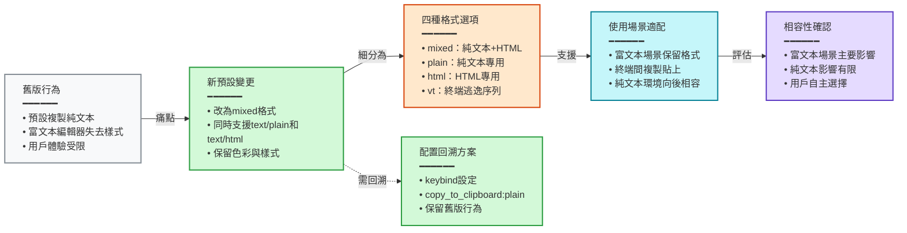
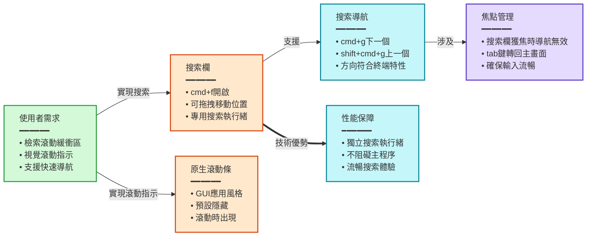
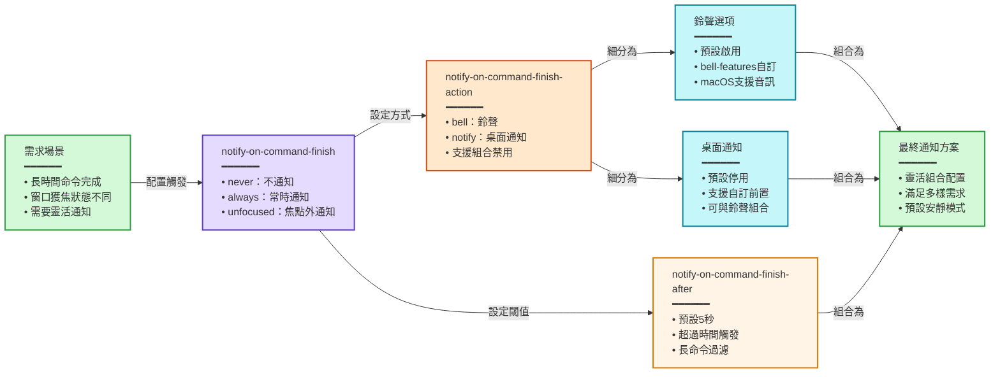
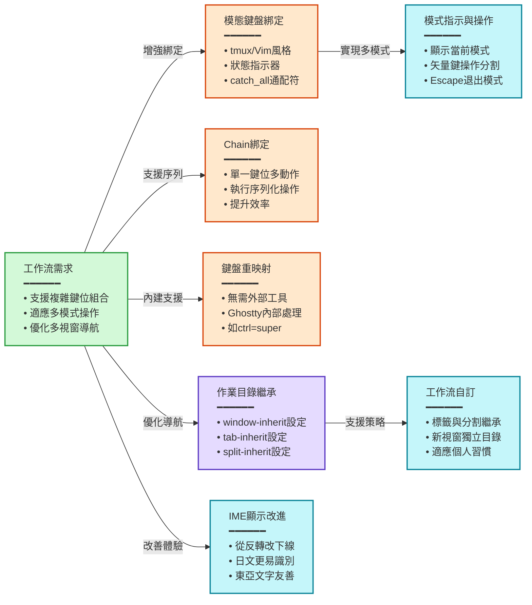
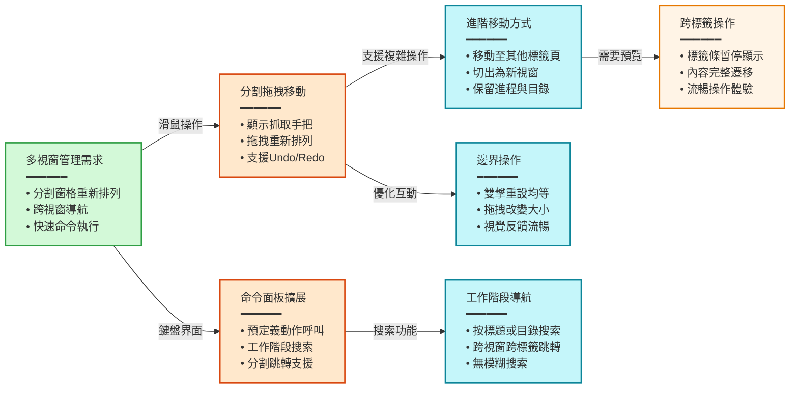
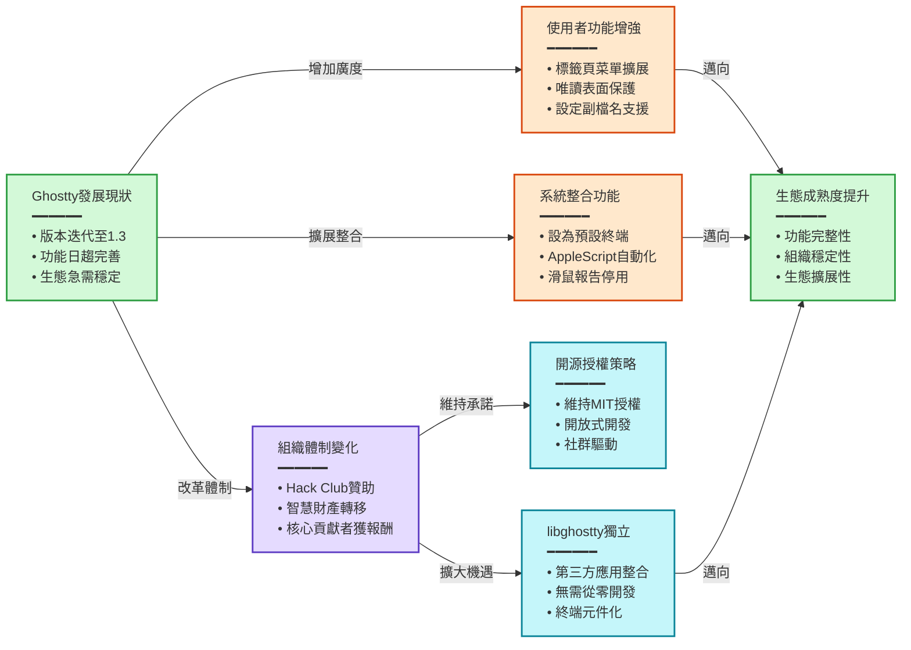

> [!info] 來源資訊
> - **原始網址**：[zenn.dev](https://zenn.dev/kawarimidoll/articles/5382959edf38fc)
> - **加入日期**：2026-03-27
> - **來源**：Safari Reading List
> - **摘要工具**：claude-code (haiku)
> - **處理日期**：2026-03-29

---

### 概述

Ghostty 1.3.0於2026年3月發布，帶來大量新機能與改進，隨後1.3.1版本修正了初期問題。此版本引入了模態鍵盤綁定、滾動條搜索、命令完成通知、分割窗格拖拽移動等核心功能增強。核心變更包括剪貼板複製格式預設從純文本改為混合格式（同時支援純文本與HTML），使複製內容在富文本編輯器中能保留格式。同時，Ghostty 1.3的開發體制實現了重大轉變——成為Hack Club非營利組織旗下的專案，同時完成了libghostty核心庫的獨立抽取，使第三方應用可直接整合終端功能。

### 章節摘要

#### 破壞性變更：剪貼板複製格式預設改動

- `copy_to_clipboard` 的預設值從 `plain`（純文本）變更為 `mixed`（混合格式）
- `mixed` 格式同時在剪貼板中設定 `text/plain` 和 `text/html` 兩種格式，使複製內容貼至富文本編輯器時能保留色彩與樣式
- 新增四種格式選項：
  - `mixed`：純文本 + HTML（新預設）
  - `plain`：純文本專用（回溯到舊版行為）
  - `html`：HTML專用
  - `vt`：保留終端逃逸序列，可用於終端間複製貼上
- 用戶若欲保留舊版行為，可設定 `keybind = cmd+c=copy_to_clipboard:plain` 明確指定
- 此變更主要影響富文本場景，對純文本使用場景影響有限

#### 滾動條搜索與顯示功能

- **滾動條搜索**：新增檢索功能，內部採用專用搜索執行緒運作，不阻礙主程序
  - `cmd+f` 開啟搜索欄，可搜索整個滾動緩衝區
  - 搜索欄可拖拽移動位置
  - `cmd+g` / `shift+cmd+g` 進行前後搜索命中的移動
  - 搜索欄獲焦時前後移動功能無效，需先透過 `tab` 鍵將焦點轉回主畫面
  - 搜索方向與網頁瀏覽器相反：`next` 向上、`previous` 向下（符合終端光標一般位於底部的特性，但容易造成習慣反差）
- **原生滾動條**：新增GUI應用風格的滾動條顯示，預設隱藏，滾動時才出現

#### 命令完成通知與相關設定

- 長時間執行的命令完成時提供通知提醒
- **`notify-on-command-finish` 設定**：控制是否通知
  - `never`：不通知（預設）
  - `always`：常時通知（受時間設定限制，非所有命令都觸發）
  - `unfocused`：僅當執行表面未獲焦時通知
- **`notify-on-command-finish-action` 設定**：控制通知方式
  - `bell`：鈴聲（預設啟用）
  - `notify`：桌面通知（預設停用）
  - 可使用 `no-` 前置詞停用，支援組合設定，預設為 `bell,no-notify`
  - 鈴聲行為可透過 `bell-features` 選項設定，macOS 1.3.0起支援 `bell-features = audio` 使用自訂音訊檔案
- **`notify-on-command-finish-after` 設定**：設定時間閾值，命令執行超過此時間才發送通知
  - 預設為5秒，可實現「僅長時間命令通知」的需求
  - 上限為 `584y 49w 23h 34m 33s 709ms 551µs 615ns`

#### 鍵盤輸入與工作流程優化

- **模態鍵盤綁定（Key Tables）**：tmux與Vim風格的模態鍵盤設置
  - 在鍵盤綁定前加 `{table-name}/` 前置詞定義特定模式
  - 範例：定義 `resize` 模式，`super+shift+r` 啟動，矢量鍵控制分割窗格大小，`escape` 退出
  - 畫面下方顯示目前所在模式的指示器
  - `catch_all` 通配符可捕捉未定義的鍵位
- **Chain 鍵盤綁定**：單一鍵位可執行多個動作序列
- **鍵盤重映射（`key-remap`）**：Ghostty內進行鍵盤重映射，無需依賴Karabiner等外部工具
  - 例如 `key-remap = ctrl=super` 使Ghostty內Ctrl鍵被視為Super鍵
- **作業目錄繼承控制**：新建標籤頁、分割、視窗時，個別控制是否繼承現有工作目錄
  - `window-inherit-working-directory = false`
  - `tab-inherit-working-directory = true`
  - `split-inherit-working-directory = true`
  - 允許靈活策略，如「標籤與分割繼承目錄，新視窗從主目錄開始」
- **IME輸入顯示改變**：IME輸入中的視覺指示從反轉（invert）改為下線（underline），日文使用者更容易識別

#### 分割窗格操作與命令面板增強

- **分割窗格拖拽移動與均等化**：
  - 滑鼠置於分割窗格上部時顯示抓取手把，可拖拽重新排列分割
  - 支援移動至其他標籤頁或切出為新視窗，內容、工作目錄、運行進程一併移動
  - 支援Undo/Redo操作
  - 分割邊界雙擊可將分割重設為均等大小
  - 移動至其他標籤時需在標籤條上暫停以等待標籤預覽
- **命令面板擴展**：
  - `command-palette-entry` 於1.3在macOS上啟用，可預定義動作並從面板呼叫執行
  - 新增工作階段搜索功能，可按終端標題或工作目錄搜索並跳轉至目標表面
  - 支援跨視窗、跨標籤的分割窗格跳轉
  - 目前不支援模糊搜索（fuzzy find）

#### 次要功能與開發體制變化

- **標籤頁右鍵菜單增強**：菜單項目增加，標籤標題支援雙擊編輯；設定的標籤顏色在命令面板搜索時也顯示
- **設定檔案副檔名**：Ghostty設定檔案可使用 `.ghostty` 副檔名，過去使用無副檔名的 `~/.config/ghostty/config`
- **唯讀表面功能**：透過 `toggle_readonly` 動作將表面標記為唯讀，可進行選擇、複製但禁止向執行進程傳入輸入事件，適合監看伺服器日誌等場景；關閉前會顯示警告
- **預設終端應用設置**：可設Ghostty為系統預設終端，執行shell腳本時經確認後在Ghostty中運行
- **滑鼠報告停用**：`mouse-reporting = false` 禁止將滑鼠事件傳至應用，防止TUI應用誤操作
- **AppleScript支援（預覽）**：macOS支援透過AppleScript自動化視窗、標籤、分割操作及文字輸入；首次執行需授予TCC權限；可透過 `macos-applescript = false` 停用；目前為預覽狀態，未來API可能變更
- **自訂著色器增強**：新增光標形狀、位置、前次位置、變更經過時間、配色方案等uniform參數
- **開發體制變化**：
  - Ghostty從1.2至1.3期間成為Hack Club非營利組織旗下專案，正式接受捐贈
  - 智慧財產轉移至Hack Club，但維持MIT授權的開源開發
  - 數名核心貢獻者獲正式僱傭與薪酬支付
  - 創始人Mitchell個人未收取任何報酬
- **libghostty 核心庫獨立**：Ghostty 1.3期間完成libghostty抽取，第三方應用可直接整合此核心庫作為終端元件，無需從零開發終端模擬器；今後Ghostty應用與libghostty將獨立版本管理，libghostty發布時程未定

### 重點整理

- **破壞性變更與相容性**
  - 剪貼板複製預設改為混合格式，影響涉及富文本編輯器；純文本場景相容性影響小，可設定 `copy_to_clipboard:plain` 保留舊版行為

- **使用者體驗增強**
  - 滾動條搜索、原生滾動條、分割拖拽、標籤頁菜單等視覺與互動升級
  - 命令面板工作階段搜索提升多視窗導航效率
  - 唯讀表面保護長期運行進程免受誤操作

- **鍵盤與工作流客製化**
  - 模態鍵盤綁定（Key Tables）支援Vim/tmux風格配置，chain綁定支援動作組合
  - 作業目錄繼承可按視窗類型獨立設定，提升工作流靈活性
  - 鍵盤重映射內建支援，無需外部工具

- **平台與自動化支援**
  - AppleScript支援（預覽）實現macOS自動化，功能豐富但API可能演變
  - 可設為系統預設終端應用，整合度提升
  - IME輸入顯示改善對東亞文字使用者友善

- **命令完成與通知**
  - 長時間命令完成可透過鈴聲或桌面通知提醒，時間閾值可自訂（預設5秒）
  - 支援焦點感知（unfocused模式）減少干擾

- **開發體制與生態穩定**
  - Hack Club非營利基金會贊助確保長期可持續性，核心貢獻者獲正式報酬
  - MIT授權維持開源承諾
  - libghostty獨立完成，開啟第三方應用整合機制，擴大生態價值

- **技術增強**
  - 自訂著色器uniform參數擴充支援視覺效果開發
  - 專用搜索執行緒設計保證搜索不影響主程序效能
  - 模式狀態指示器與Undo/Redo支援提升操作可信度
